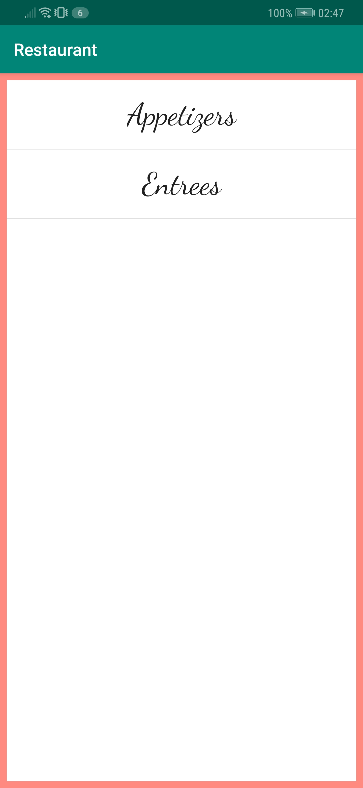
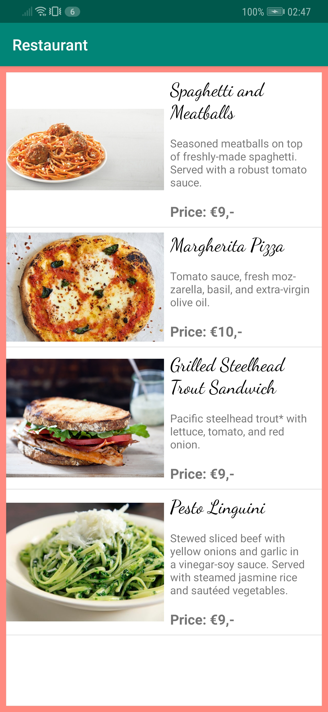
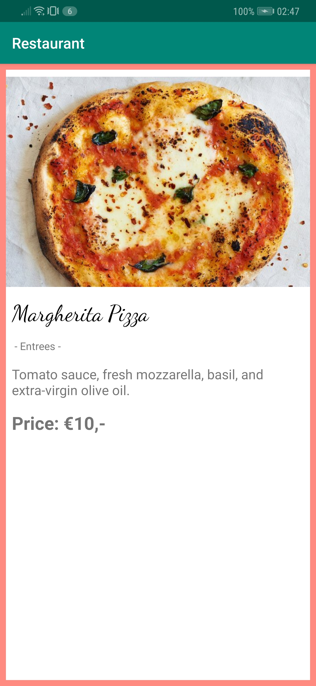

# Restaurant
A short description of the app Restaurant.

## Getting Started
### Prerequisites
The app is created in Android-Studio, it is currently made for API 24 Nougat (Android 7.0), but also confirmed running on API 28 Pie (Android 9.0).
An android phone with either one of those Android versions (and most likely the versions in between) will suffice.

## Test
When launching the app, a screen appears showing the categories of the restaurant's menu. Here the user can click on one of the categories.

 

When a category has been clicked on, a new screen appears showing the menu items belonging to that category. The items are obtained from the restaurant's online database. Now the user can click on one of the menu items.

 

When one of the menu items has been clicked on, the app will showcase that item in a new screen.

 

## Author
* Me

## Acknowledgements
* Renske Talsma
* Natasja Wezel
